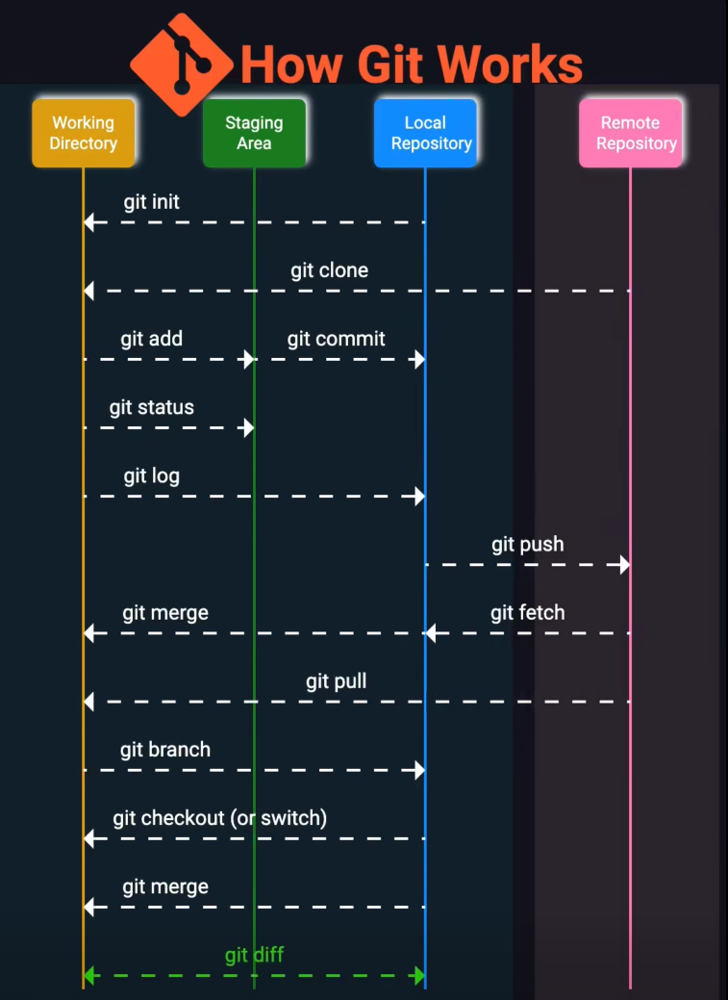

# 🚀 Collaborating Guidelines & Workflows

Welcome to the **HCMUT-Student-Hub** project! To ensure smooth collaboration, maintain code quality, and prevent conflicts, please read this guide CAREFULLY before actually contributing.

---

## I. Initial Setup (One-time)

### 1. SSH Key Configuration

* **Purpose:** Setting up an SSH key allow you to interact with the repository securely without entering your username and personal access token every time.
* **Guide:** Please follow the official GitHub documentation: [Connecting to Github with SSH]([https://docs.github.com/en/authentication/connecting-to-github-with-ssh](https://docs.github.com/en/authentication/connecting-to-github-with-ssh)).

### 2. Clone the Repository

Once your SSH key is set up successfully, open your Terminal/Git Bash and run the following commands to clone the repo to your local machine and navigate into it:

```bash
git clone git@github.com:ndongdoan/hcmut-student-hub.git
cd hcmut-student-hub
```

---

## II. Understanding Git

Before using any Git commands, it's crucial to understand where your code currently resides, and how these Git commands actually interact with them. There are 4 primary "zones":

<p align="center"> <!-- markdownlint-disable-line MD033 -->
   <!-- markdownlint-disable-line MD033 -->
</p>

1. **Working Directory:** Where you're currently working, writing code, modifying files.
2. **Staging Area:** The "waiting room", or a temporary space between your working directory and the local repo, where your modified files are added and stored (using `git add`).
3. **Local Repository:** Your local repo with its local history on your machine (using `git commit`).
4. **Remote Repository:** The remote repo stored on Github (using `git commit`).

---

## III. Workflow Guide

🚨 **RULE:** **NEVER push code directly to the `main` branch.** All changes must go through a Pull Request.

### Step 1: Sync with the latest codebase

Always make sure you are branching off the most up-to-date version of the project before doing any work/changes.

```bash
git switch main
git pull origin main
```

If you are currently working on a branch, always pull the latest changes from `main` into your branch before writing new code to avoid conflicts.

```bash
# 1. Update your local main branch
git switch main
git pull origin main

# 2. Go back to your personal branch
git switch <type>/<your-branch-name>

# 3. Merge the updated main into your branch
git merge main
```

### Step 2: Create a new personal branch (If you haven't had one)

Whenever you want to develop something new or make some changes to the codebase, **ALWAYS** create a dedicated branch for your work.

```bash
git switch -c <type>/<your-branch-name>
```

### Step 3: Code, Stage, and Commit

Work on your branch. Commit your changes logically as you complete small milestones.

#### 💡 Best Practices for Commiting

* **Single Purpose:** Each commit should represent a **single, cohesive logical change** (e.g., fixing one specific bug, or adding one isolated UI component).
* **Size Matters:** Avoid massive "monster" commits that modify dozens of unrelated files. In contrast, avoid overly fragmented commits (too small).

*(Note: Always write clear, descriptive commit messages so others understand what you did).*

#### 1. Staging Files

You can stage all changed files at once, or be selective and specific:

* To stage **all** changes:

```bash
git add .
```

* To stage **specific files** (recommended for better commits):

```bash
git add <file1-directory> <file2-directory> ...
```

* To undo (unstage) a `git add`: If you accidentally staged a file, you can remove it from the staging area *without* losing your code:

```bash
git restore --staged <file-name>
```

#### 2. Commiting Files

Once your files are staged, commit them with a descriptive message:

```bash
git commit -m "feat: add search bar component to the header"
```

* Undo a `git commit`: If you made a mistake in your last commit (e.g., forgot a file or a typo in your commit message), you can undo it using the following command:

```bash
git reset --soft HEAD~1
```

This undoes your latest commit, and brings your file(s) back to the staging area, where you can unstage them again. If you want to undoes the commit **AND** unstage those files at the same time, use the following command:

```bash
git reset HEAD~1
```

### Step 4: Push your branch to GitHub

```bash
git push origin <type>/<your-branch-name>
```

If you accidentally push the wrong code and want to reverse it, do the following procedure:

```bash
# 1. Find the ID of your bad commit (the commit that you pushed unintentionally)
git log --oneline

# 2. Revert that bad commit (Github will create a new "reversal" commit)
git revert <id>

# 3. Push the reversal commit
git push origin <type>/<your-branch-name>
```

Now, you can work on your new code, or fix it, then stage your files, commit, and push normally.

### Step 5: Open a Pull Request (PR) & Code Review

After you have finished working on your personal branch, you need to open a PR before you can actually merge the code to the `main` branch.

1. Go to the repository on GitHub and click on the **Pull requests** tab.
2. Click the green **New pull request** button. Set the `base` branch to `main` and the `compare` branch to your feature branch.
3. Add a clear title and description for your PR.
4. Assign at least **one team member** as a **Reviewer**.
5. The reviewer will inspect your code. If approved, they will click **Merge pull request** to combine your work into `main`.
6. Once merged successfully, please delete your feature branch to keep the repo organized.

---

## IV. Branch Naming Convention

To keep our repo organized, please follow these rules when naming your new branch:

### 1. General Rules

* Use **lowercase** letters only.
* Use **hyphens (`-`)** to separate words. Do not use spaces or underscores (`_`).
* Keep the name short, clear, and descriptive.
* **Format:** `<type>/<your-branch-name>`.

### 2. Branch Types

Always use these following prefixes for `<type>` to indicate the nature of your work:

* **`feat/`** (Feature): Adding a new feature or functionality to the project.
  * *Example:* `feat/search-bar`, `feat/user-login`
* **`fix/`** (Bug Fix): Fixing a bug or an error in the codebase.
  * *Example:* `fix/header-alignment`, `fix/login-crash`
* **`docs/`** (Documentation): Updating or adding documentation (like `README.md`, `CONTRIBUTING.md`).
  * *Example:* `docs/update-workflow`, `docs/api-endpoints`
* **`style/`** (Formatting): Code changes that do not affect the meaning of the code (white-space, formatting, missing semi-colons, etc.).
  * *Example:* `style/format-css`, `style/lint-warnings`
* **`refactor/`** (Refactoring): A code change that neither fixes a bug nor adds a feature (e.g., restructuring code for better readability or performance).
  * *Example:* `refactor/user-api-logic`, `refactor/button-component`
* **`chore/`** (Maintenance): Routine tasks, updating dependencies, or configuration changes.
  * *Example:* `chore/update-dependencies`, `chore/setup-tailwind`

---

## V. Commit Message Convention

We follow the [Conventional Commits](https://www.conventionalcommits.org/) specification. This makes it easier to read the history and auto-generate changelogs using GitHub Actions.

### Format

`type: short description`

### Types: Aligns with our [branch prefixes](#2-branch-types)

* `feat:` A new feature
* `fix:` A bug fix
* `docs:` Documentation only changes
* `style:` Changes that do not affect the meaning of the code (white-space, formatting, etc.)
* `refactor:` A code change that neither fixes a bug nor adds a feature
* `chore:` Changes to the build process or auxiliary tools/libraries

### Rules for the Description

* Use the imperative, present tense: "add" not "added" or "adds".
* Do not capitalize the first letter.
* No period (.) at the end.

**✅ Good Example:** `feat: add search bar component to header`

**❌ Bad Example:** `Added the search bar.` or `Update code` or `fix: bugs`

---

Happy Coding! 🎉
